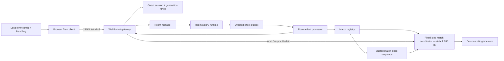

# TETR-D 实时对战架构

## 目标与边界

目标是构建一个服务端权威、可重连、可审计的现代俄罗斯方块 1v1 系统。旋转系统固定为 `srs-plus-v1`；当前冻结的对战规则版本为 `versus-srs-plus-tetrio-s2-v2`。

服务端已具备共享 7-Bag、固定步进 Match Coordinator、双方棋盘模拟、攻击/垃圾、KO、snapshot 和 `match.end`。浏览器已具备本地配置 UI、Handling 引擎和非阻塞输入队列；完整比赛棋盘、预测校正、delta 优化和持久回放仍属于后续阶段。

## 模块



### `packages/game-core`

- 无网络、DOM、文件 I/O 或全局随机状态。
- 包含方块几何、SRS+ 90° kick table、独立版本化的克制型 180°扩展、碰撞、棋盘/锁定/消行、Spin、攻击、垃圾和确定性共享 7-Bag。
- 客户端预测与服务端模拟必须使用同一版本的核心代码和整数 frame；时长参数先以毫秒/每秒定义，再按实际模拟频率换算为 frame。

### `packages/room-core`

- 纯状态机：两个玩家席位、可选观战、房主、准备、倒计时、番战、重连和过期。
- 客户端不能注入 `actorPlayerId`、`atMs`、`connection.*`、`timer.*` 或 `match.finished`。
- `revision` 用于控制写冲突，`presenceSequence` 覆盖所有公开状态提交。

### `apps/server`

- `gatewayConnection.ts`：单连接握手、认证、心跳、限流和消息串行化。
- `webSocketGateway.ts`：HTTP Upgrade、路径、Origin 和子协议边界。
- `sessionStore.ts`：不透明 resume token、HMAC digest、单次轮换和 connection generation。
- `roomActor.ts`、`roomRuntime.ts`、`roomManager.ts`：可信命令映射、幂等、计时器和房间生命周期。
- `roomCommitOutbox.ts`：按房间有序投递 effect，使用稳定 delivery ID 重试关键动作。
- `roomEffectProcessor.ts`：viewer-specific 投影、倒计时、移除/关闭通知和比赛启动/断线 effect。
- `matchPieceSequence.ts`：一局唯一的共享方块序列、commitment、有限窗口和 reveal 验证。
- `matches/fixedStepLoop.ts`：单调时钟驱动的固定步进循环、有限追帧和过载状态；不会为了赶上墙钟而跳过模拟 frame。
- `matches/matchRegistry.ts`：一个进程内集中拥有活动比赛，用一条循环驱动少量 1v1 Coordinator，并负责 snapshot/终局投递。
- `matches/matchCoordinator.ts`：串行接收输入，运行双方权威模拟，在同 frame 内先净化双方攻击，再投递垃圾和裁定结果。

### `apps/web`

- `config/v3`：版本化玩家配置、迁移和 `localStorage` 持久化；整份配置不上传服务器。
- `input/handlingEngine.ts`：在浏览器本地执行 DAS、ARR、DCD、SDF 和方向切换，产出与帧率无关的具体操作。
- `input/MatchInputController.ts`：先调用本地预测器，再把具体操作交给发送队列。
- `realtime/InputOutbox.ts`：按 `inputEpoch + sequence` 连续发送，允许多个批次同时在途；ACK 不阻塞后续输入。
- 设置页和 Handling Lab 用于键位捕获、冲突提示、参数调整、导入导出和本地试手感。

## Match Coordinator 的权威边界

“服务端权威”不等于每次操作都等待服务器许可。客户端把物理按键按本地 Handling 展开成具体操作，先立即更新本地预测画面，再流水上传；它不提交方块坐标、消行、攻击量或胜负。Coordinator 为操作排序、验证并分配服务器 frame，推进重力、锁定、消行、攻击/抵消、垃圾和 top-out，并以 input ack、state hash、snapshot 与 `match.end` 给客户端异步校正和裁决。

这样本地连续两次操作之间没有 RTT 下限。代价是恶意客户端可绕过正常 Handling 频率；当前面向不超过 10 名可信玩家的部署接受这一取舍，但服务器仍拒绝非法碰撞、越界状态和伪造结果。

`MATCH_TICK_RATE_HZ` 控制内部模拟频率，允许 `60..1000` 的整数，默认 `240`。该值会随 `match.start.simulationHz` 和 `/api/health.matchTickRateHz` 暴露；它不等于浏览器渲染帧率，也不等于网络 snapshot 频率。当前 snapshot 固定为 30 Hz，避免 240 Hz 模拟直接放大网络流量。

## 同包 7-Bag 设计

每场比赛只生成一个私密 128-bit seed，并只创建一个 `SharedSevenBagState`。服务端用它连续生成 bag：

```text
bag 0: [T, I, O, L, S, Z, J]
bag 1: [J, Z, T, O, I, L, S]
...
```

玩家 A 和 B 都读取这条同一序列，但分别保存 `cursorA` 与 `cursorB`。因此：

- `pieceAt(A, n) === pieceAt(B, n)` 对任意序号 n 成立；
- A 先消耗 30 块不会推动 B 的游标；
- 空 Hold 需要补一块时只推进该玩家游标；已有 Hold 的交换不消费队列；
- 操作速度、网络延迟和 Hold 时机都不能重排 bag。

开局 commitment 为绑定 `matchId + rulesetVersion + seed` 的 SHA-256。协议只发最多 14 块的窗口；seed 在比赛活动期间不离开服务端。局末 reveal 后可以重新生成每个 bag 并验证 commitment。

比赛方块随机与未来的垃圾洞口随机必须是两个独立的随机域，不能共用游标或 seed 派生上下文。

## 连接与重连

1. 客户端首包发送 `hello(protocolVersion=3, buildId, resumeToken?)`。
2. 服务端返回 `welcome`，游客认证后返回 `auth.ok` 与 resume token。
3. 每次成功 resume 都原子消费旧 token、发行新 token，并增加 connection generation。
4. ConnectionHub 只接受当前 generation；旧 Socket 的迟到消息和 close 事件不会改变房间。
5. 对局内断线宽限 15 秒，大厅/倒计时/局间宽限 60 秒。

## 一致性与失败恢复

- 每个房间的用户命令和系统事件串行执行。
- 每场比赛的输入、tick、双方同帧攻击净化和终局裁决由一个 Coordinator 串行执行；比赛间由 Registry 的稳定顺序推进。
- `(sessionId, requestId)` 幂等缓存返回原 receipt，但永不重放 effect。
- Runtime 在每次 dispatch 后按最新状态幂等对账计时器；早到或暂时失败的 timer 会重新挂载。
- Effect outbox 按房间 FIFO 处理，重试使用稳定 `(roomId, presenceSequence, effectIndex)` delivery ID。
- 外部发送采用背压上限；过慢连接可被隔离，不能阻塞房间 actor。

## 后续边界

服务端 Coordinator 已负责可配置固定 tick、输入 epoch/sequence、具体操作验证、锁定与消行、攻击/垃圾、KO、状态 hash、snapshot 和 `match.end`。下一阶段重点是浏览器比赛棋盘、完整局面预测、snapshot 回滚重放、Safe Lock/IRS/IHS 最终接线、可选 delta、持久回放，以及真实双客户端下的重连、过载和发布回滚演练；这些完成前仍只应按 staging 部署。
