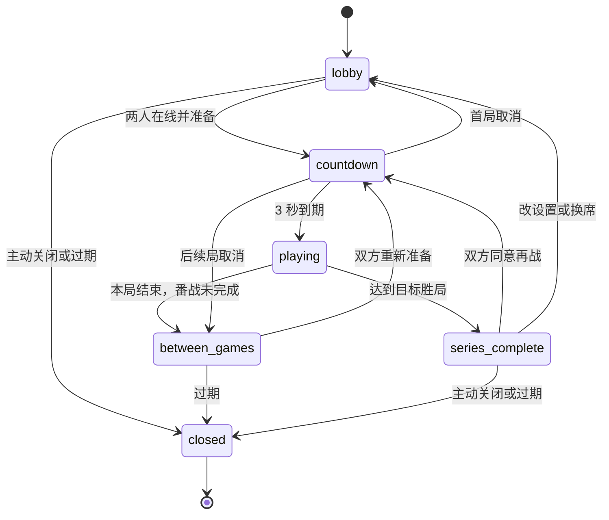

# 双人房间模式

## 定位

MVP 是邀请制、非排位的现代俄罗斯方块 1v1 房间。固定两个玩家席位；观战是房主可开启的附加身份，不会形成第三名参赛者。

本文记录已实现的房间状态机与服务端权威比赛规则。当前服务端已经接入可配置固定步进模拟（默认 240 Hz）；浏览器对局 UI 和客户端预测/校正仍待实现。

| 项目 | 当前规则 |
|---|---|
| 玩家席位 | 固定 2 个 |
| 观战 | 默认关闭；开启后最多 6 人 |
| 番战 | 默认先胜 3 局；可选 1/2/3/5 |
| 开始 | 双方在线并准备后自动倒计时 3 秒 |
| 对局内重连 | 15 秒；比赛不暂停 |
| 大厅/倒计时/局间重连 | 60 秒 |
| 房间绝对寿命 | 6 小时 |

## 房主与席位

房主权限和参赛席位是独立维度：房主可以是玩家或观战者，也可以把房主转给任意已连接成员。

- 创建者默认占 `seat[0]`、成为房主且未准备。
- 玩家只可在 `lobby` 或 `series_complete` 进入空席。
- 活动番战中不能换人或临时替补。
- 房主离开或超时后，先按加入顺序转给在线玩家，再转给在线观战者；无人在线时为 `null`。
- 原房主重连后不会自动夺回权限。

## 状态机



### `lobby`

房主可修改 `targetWins` 和 `allowSpectators`，成员可换席。房主不能强制开局，也不能替其他玩家准备。

### `countdown`

固定 3 秒并使用服务端时间。任一在席玩家取消准备或断线会取消倒计时并清除双方准备；观战者断线不影响开局。旧回调以 `countdownId` 吸收，调度失败会按当前状态重新对账。

### `playing`

目标规则是只接受当前两名参赛者的比赛输入。断线不暂停比赛，并立即清除该玩家 held input；15 秒超时后只能由服务端请求 `disconnect_timeout` 裁决。

Match Coordinator 只接受当前参赛者的 `match.input` 与 `match.forfeit`，观战者只能请求公开 snapshot。服务端按 `inputEpoch + sequence` 调度动作，默认以 240 Hz 推进权威棋盘、攻击/垃圾与 top-out，并以 30 Hz snapshot 校正；`MATCH_TICK_RATE_HZ` 可在 `60..1000` 范围配置。`match.end` 再作为可信系统事件回写 RoomActor，推进比分和番战状态。

### `between_games`

保留比分与锁定规则。双方重新准备后开始下一局；房主不能修改规则或踢出活动番战中的对手。

### `series_complete`

显示最终比分，规则恢复可编辑。两名在席玩家都同意再战后创建新番战；改规则、换席或断线会清除再战投票。

### `closed`

拒绝新写命令，取消该房间拥有的计时器，通知成员并清除 SessionStore/ConnectionHub 的房间绑定。

## 同包公平性

每一局只有一条共享 7-Bag 序列。假设第 0 包是：

```text
[S, T, J, O, I, Z, L]
```

那么两名玩家的第 0 包都严格是这一排列，第 1、2、3 包同理。两人只拥有独立的消费游标：

- A 快速落块不会消耗 B 的方块；
- 空 Hold 为 A 补新块时只推进 A 的游标；
- 已有 Hold 的交换不推进游标；
- 任何客户端都不能请求重洗 bag 或自行上报 next queue。

服务端开局发送同一 commitment 和同一 14 块窗口。真实双客户端测试会断言两人窗口逐项相等，并将索引 `0..6`、`7..13` 分别验证为完整 7-Bag；两个玩家在对应 bag 中的排列完全相同。

## 权限

| 操作 | 房主 | 在席玩家 | 观战者 | 服务端 |
|---|:---:|:---:|:---:|:---:|
| 查看房间 | ✓ | ✓ | ✓ | ✓ |
| 申请空席 | ✓ | ✓ | ✓ | — |
| 准备/再战投票 | 在席时 | ✓ | — | — |
| 修改设置 | ✓ | — | — | — |
| 转移房主 | ✓ | — | — | — |
| 踢成员 | ✓ | — | — | — |
| 踢活动对手 | — | — | — | 管理裁决 |
| 强制开始/代准备 | — | — | — | — |
| 裁定比赛与比分 | — | — | — | ✓ |

房主不能踢自己。最近 64 个被踢 player ID 进入有界 denylist；网关还需用会话/IP 限流抵御身份轮换。

## 重连

- 每次成功 resume 都轮换 token 和 connection generation。
- 新连接原子替代旧连接；旧 Socket 的迟到 close 不会触发断线。
- 对局内保留 15 秒，大厅、倒计时和局间保留 60 秒。
- 倒计时中的在席玩家断线会立即取消倒计时。
- 大厅重连超时会发送 `room.removed(reason=reconnect_timeout)` 并释放席位。
- 同一 match 最多发出一次断线终局请求。

## 并发与版本

控制写使用 `requestId + roomId + expectedRevision`。相同 requestId/相同负载返回首次 receipt；同 ID 不同负载返回 `REQUEST_ID_REUSED`。`revision` 不匹配返回 `REVISION_CONFLICT`，纯 presence 变化只推进 `presenceSequence`，避免观战者上下线让玩家命令持续冲突。

## 实现入口

- 房间状态机：`packages/room-core`
- Actor/runtime/manager：`apps/server/src/roomActor.ts`、`apps/server/src/rooms/roomRuntime.ts`、`apps/server/src/rooms/roomManager.ts`
- 网络与会话：`apps/server/src/gateway/webSocketGateway.ts`、`realtimeService.ts`
- Effect 与共享开局序列：`apps/server/src/rooms/roomEffectProcessor.ts`、`apps/server/src/matchPieceSequence.ts`
- 比赛消息/生命周期：`apps/server/src/matches/matchMessageService.ts`、`matchRegistry.ts`、`matchCoordinator.ts`
- 协议：[实时协议 v4](protocol.md)
